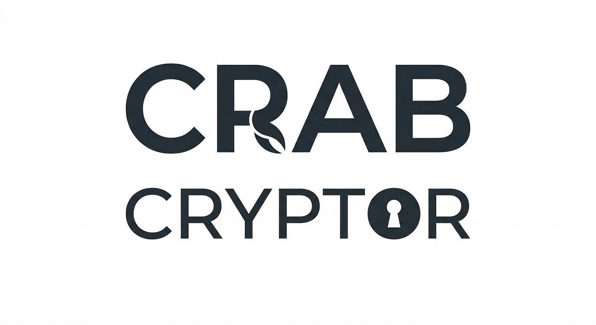

# crab-cryptor

<p align="center">
	
</p>

[](https://crates.io/crates/crab-cryptor)
[](LICENSE.txt)

A secure, interactive file cryptor written in Rust.

`crab-cryptor` encrypts and decrypts files and directories using XChaCha20-Poly1305 stream encryption, Argon2id key derivation, and gzip compression. It is designed as an interactive CLI for batch directory operations without requiring command-line flags.

## Features

- Authenticated encryption via XChaCha20-Poly1305
- Memory-hard key derivation via Argon2id (64 MiB RAM, 3 iterations)
- File and directory name encryption with context-derived keys and URL-safe Base64 output
- Gzip compression before encryption
- Parallel file processing via Rayon
- Operation confirmation before modifying files
- Atomic encrypted file replacement via temporary files and rename
- Path traversal protection during archive extraction
- Symbolic links are skipped instead of being followed
- Passwords and derived keys are zeroized after use

## Install

```bash
cargo install crab-cryptor
```

## Usage

Run `crab` and follow the prompts:

```text
crab v4.1.0
Author: xl_g <lr_kkr@outlook.com>
A secure file cryptor

? Choose function: encrypt
? Work directory: data/
? Encryption password:
Scanning files...
? Will encrypt 12 files and 4 directories in "data/". Continue? (y/N)
```

### Encrypt a directory

```text
crab
? Choose function: encrypt
? Work directory: path/to/dir
? Encryption password:
Scanning files...
? Will encrypt 12 files and 4 directories in "path/to/dir". Continue? (y/N)
```

Encrypted files receive the `.crab` extension. Encrypted directories are renamed to URL-safe Base64 plus the `[crab]` suffix.

### Decrypt a directory

```text
crab
? Choose function: decrypt
? Work directory: path/to/dir
? Decryption password:
Scanning files...
? Will decrypt 12 files and 4 directories in "path/to/dir". Continue? (y/N)
```

During decryption, file contents are restored into the parent directory of each encrypted file. Decryption only targets files that keep the `.crab` extension and a valid `CRABv4` header.

## Security Notes

- File contents are encrypted and authenticated.
- File and directory names are obfuscated with per-parent derived name keys, while directory encryption state is still represented by the `[crab]` suffix.
- Archive extraction only accepts regular files and directories. Path traversal attempts, links, devices, FIFOs, and overwrite targets are rejected.
- Symlinks are skipped deliberately to avoid accidentally following links outside the selected tree.
- If any item fails during processing, the command exits with an error after reporting the number of failed entries.

## Limitations

- Newly encrypted names use a `v2_` prefix and a context-derived key. Directories encrypted by older releases remain decryptable, but directories encrypted by this release require a build that understands the `v2_` format.
- The tool is interactive by design and does not currently expose a non-interactive CLI mode.
- Decryption expects files produced by this tool, identified by the `CRABv4` magic header, and still carrying the `.crab` extension.

## License

MIT — see [LICENSE.txt](LICENSE.txt)

## Reference

- [Rust file encryption](https://kerkour.com/rust-file-encryption)
